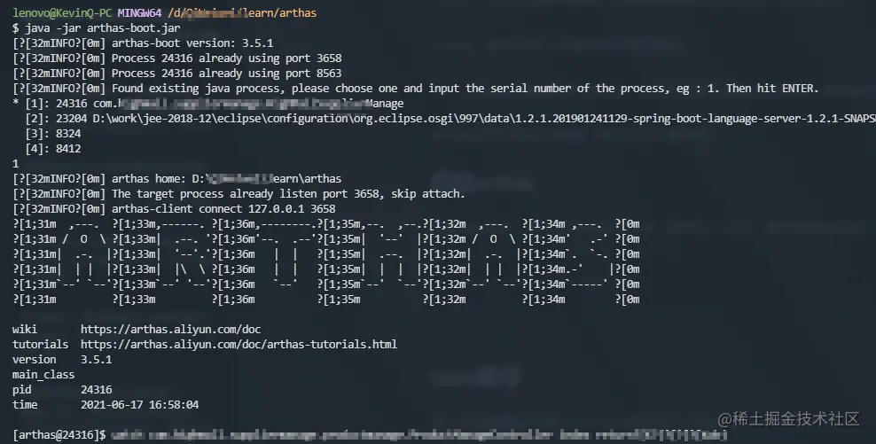
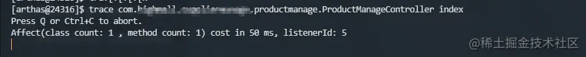
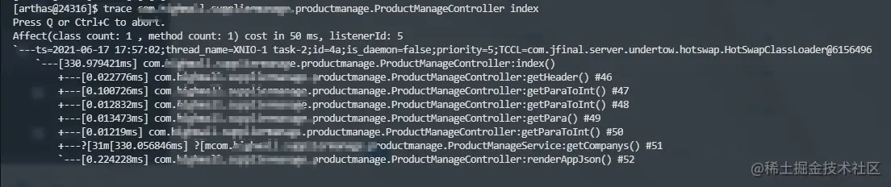
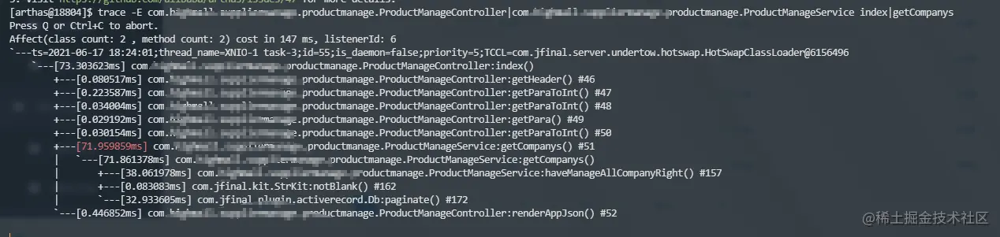

# arthas trace 命令查看代码各方法响应时间
问题来了：
1. 如何在线上系统运行的情况下定位问题代码？
2. 如何避免修改原代码来定位问题代码？

最基本的定位方法是：定位到卡顿的接口，通过在各个方法**请求前与请求后打印时间戳**来计算各方法的响应时间。

这个基本方法有什么问题呢？

1. 如果开发人员无权获取生产环境怎么重现。
2. 如果调用方法很多的情况下，通过响应时间戳定位效率太低。

## Arthas 工具

[Arthas 官网](https://link.juejin.cn?target=https%3A%2F%2Farthas.aliyun.com%2Fdoc%2Findex.html)

Arthas 是阿里巴巴开源的一款 Java 诊断工具。Arthas 除了解决我们上述定位接口卡顿问题，还能解决以下问题[1]：

> 1. 这个类从哪个 jar 包加载的？为什么会报各种类相关的 Exception？
> 2. 我改的代码为什么没有执行到？难道是我没 commit？分支搞错了？
> 3. 遇到问题无法在线上 debug，难道只能通过加日志再重新发布吗？
> 4. 线上遇到某个用户的数据处理有问题，但线上同样无法 debug，线下无法重现！
> 5. 是否有一个全局视角来查看系统的运行状况？
> 6. 有什么办法可以监控到 JVM 的实时运行状态？
> 7. 怎么快速定位应用的热点，生成火焰图？
> 8. 怎样直接从 JVM 内查找某个类的实例？

几个常用的命令：

`watch`：方法执行数据观测

`monitor`：方法执行监控

`trace`：方法内部调用路径，并输出方法路径上的每个节点上耗时

`stack：` 输出当前方法被调用的调用路径

`tt`：方法执行数据的时空隧道，记录下指定方法每次调用的入参和返回信息，并能对这些不同的时间下调用进行观测

arthas 还可以生成火焰图，我们本文不做详述。

## 启动 arthas

下载 arthas 后，命令打开对应文件夹，使用以下命令，即可启动 arthas：

```shell
shell
复制代码
java -jar arthas-boot.jar
```



## trace 命令

这一节来看看怎么用 `trace` 命令获取各个方法 `method` 的执行时间。

[trace 在线文档](https://link.juejin.cn?target=https%3A%2F%2Farthas.aliyun.com%2Fdoc%2Ftrace.html)

trace 最基本的使用方法是监听方法调用路径和各个方法的耗时：

```shell
trace class-pattern method-pattern
```

如图所示，我们监听类 `com.xxxx.productmanage.ProductManageController` 的 `index()` 方法/接口：

```shell
trace com.xxxx.productmanage.ProductManageController index
```

效果如图：



我们请求 `index()` 方法对应的接口：浏览器刷新指定页面。

查看命令行输出：



可以清晰的看到各个方法的执行时间（貌似是命令行语言设置问题导致有些符号异常），如此，我们便可以轻松的定位到方法的执行时间。

### 深入

可以看到上述命令只能看到当前类中各个方法的执行时间，如果要深入调用的其他类对应方法又该怎么办呢？

比如我们要进一步监听上述耗时较长的 `getCompanys` 方法内部调用。

#### 方法 1

```shell
trace - E class1|class2 method1|method2
```

如上述定位问题，我们执行：

```shell
trace -E com.xxxxx.ProductManageController|com.xxxx.ProductManageService index|getCompanys
```

输出结果为：

```shell
Press Q or Ctrl+C to abort.Affect(class count: 2 , method count: 2) cost in 147 ms, listenerId: 6
```

然后再次请求接口，输出结果如下图：

```shell
[arthas@18804]$ trace -E com.highmall.suppliermanage.productmanage.ProductManageController|com.highmall.suppliermanage.productmanage.ProductManageService index|getCompanysPress Q or Ctrl+C to abort.Affect(class count: 2 , method count: 2) cost in 147 ms, listenerId: 6`---ts=2021-06-17 18:24:01;thread_name=XNIO-1 task-3;id=55;is_daemon=false;priority=5;TCCL=com.jfinal.server.undertow.hotswap.HotSwapClassLoader@6156496    `---[73.303623ms] com.highmall.suppliermanage.productmanage.ProductManageController:index()        +---[0.080517ms] com.xxxx.productmanage.ProductManageController:getHeader() #46        +---[0.223587ms] com.xxxx.productmanage.ProductManageController:getParaToInt() #47        +---[0.034004ms] com.xxxx.productmanage.ProductManageController:getParaToInt() #48        +---[0.029192ms] com.xxxx.productmanage.ProductManageController:getPara() #49        +---[0.030154ms] com.xxxx.productmanage.ProductManageController:getParaToInt() #50        +---[71.959859ms] com.xxxx.ProductManageService:getCompanys() #51        |   `---[71.861378ms] com.xxxx.productmanage.ProductManageService:getCompanys()        |       +---[38.061978ms] com.xxxx.productmanage.ProductManageService:haveManageAllCompanyRight() #157        |       +---[0.083083ms] com.jfinal.kit.StrKit:notBlank() #162        |       `---[32.933605ms] com.jfinal.plugin.activerecord.Db:paginate() #172        `---[0.446852ms] com.xxxx.productmanage.ProductManageController:renderAppJson() #52
```

截图如下：



#### 方法 2

这种方法我**并没有重现**，不知是操作问题还是 arthas 版本问题，但是原操作文档有这一部分，我们暂且保留。

需要我们打开另外一个命令行窗口，执行命令:

```shell
telnet localhost 3658
```

链接到我们正在执行的 Arthas，然后执行以下命令，添加监听：

```shell
trace com.xxxxxx.productmanage.ProductManageService getCompanys --listenerId 1
```

作者：KevinQ
链接：[https://juejin.cn/post/6975014350939488269](https://juejin.cn/post/6975014350939488269)
来源：稀土掘金
著作权归作者所有。商业转载请联系作者获得授权，非商业转载请注明出处。

---
